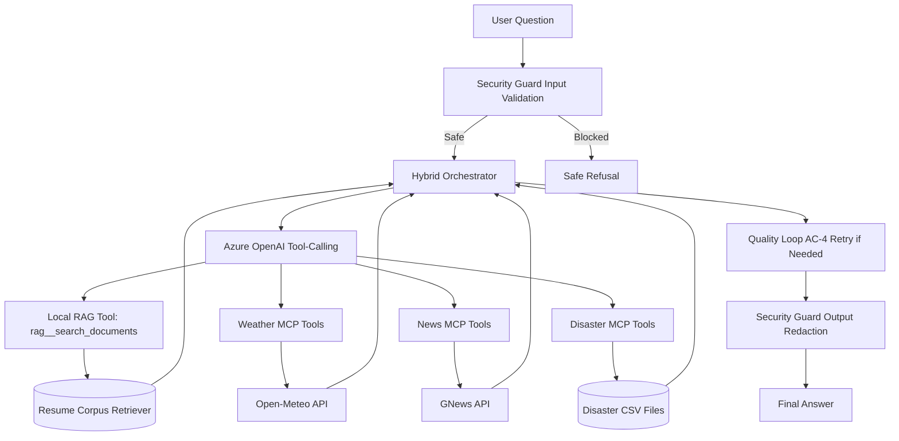

# Task 5: Hybrid Chatbot (RAG + MCP + Natural Disasters)
## Comprehensive Implementation Summary

---

## Executive Summary

Task 5 delivers a hybrid assistant composed from prior tasks and extended with natural-disaster analytics:

1. RAG module pattern from Task 2 for resume/candidate retrieval
2. Agent/MCP orchestrator pattern from Task 3 for tool-based reasoning
3. New disasters MCP server using pandas over CSV files in:
   - /Users/Uladzimir_Tulinau/Library/CloudStorage/OneDrive-EPAM/SAS AI course/final_task/DISASTERS

The assistant can answer questions across:
- Resume/candidate matching
- Weather
- Latest news
- Historical disaster events and impact metrics

Status:
- Functional implementation complete
- AC-1 through AC-5 implemented
- Test coverage implemented and passing (11/11)

---

## 1. Objective and Scope

### User goal
Build a single chatbot that combines:
- RAG (resume document intelligence)
- Agent + MCP tools (weather/news)
- Additional natural-disaster querying capability via pandas-backed MCP server

### Core outcomes
- One orchestrated chat experience with multiple tool domains
- Real disaster analytics sourced from CSV files
- Mandatory automated tests
- AC-3, AC-4, AC-5 implemented fully with measurable outputs

---

## 2. Architecture Overview

### High-level flow


### Main modules
- Entry point: main.py
- Orchestration: agent/orchestrator.py
- RAG retrieval: rag/retriever.py
- Disaster MCP server: mcp_servers/disaster_server.py
- Security controls: security_guard.py
- Evaluation: evaluation/dataset.py and evaluation/evaluator.py

---

## 3. Tools and Technologies Used

### Language and runtime
- Python 3.12
- Async orchestrator pattern with MCP client sessions

### LLM and orchestration
- Azure OpenAI GPT-4 via tool calling
- ReAct-like iterative agent loop (max iterations)

### MCP ecosystem
- Existing MCP servers reused:
  - weather_server.py (Open-Meteo)
  - news_server.py (GNews)
- New MCP server added:
  - disaster_server.py (pandas over disaster CSV files)

### Data and analytics
- pandas for loading, filtering, and ranking disaster datasets
- Multi-CSV merge with typed numeric conversion

### Testing
- unittest framework
- 11 tests in total across disaster logic, RAG retriever, evaluator metrics, and security guard

---

## 4. How the Code Works

### 4.1 Entry and modes
File: main.py

Main modes:
1. Interactive mode
   - Chat loop for user questions
2. Evaluate mode
   - Runs fixed evaluation dataset and prints aggregate metrics
   - Saves JSON report under results/

### 4.2 Hybrid orchestration
File: agent/orchestrator.py

Behavior:
1. Validate input via SecurityGuard
2. Build tool registry from 3 MCP servers + local RAG tool
3. Run iterative tool-calling loop with GPT
4. Validate tool args before each call (AC-5)
5. Apply quality score and retry once if answer quality is weak (AC-4)
6. Redact sensitive output patterns before returning answer (AC-5)

Local non-MCP tool:
- rag__search_documents
  - Routes to ResumeRAGRetriever for candidate/resume context retrieval

### 4.3 Disaster MCP server
File: mcp_servers/disaster_server.py

Dataset source:
- Reads all CSV files from DISASTERS_CSV_DIR

Implemented tools:
1. list_disaster_types(limit)
   - Type distribution and counts
2. get_disaster_summary(country, disaster_type, start_year, end_year, limit)
   - Aggregate metrics and event preview
3. top_disasters_by_metric(metric, country, disaster_type, start_year, end_year, top_n)
   - Ranking by metric (for example Total Deaths)

Server-side hardening (AC-5):
- Text input sanitization with safe-character regex
- Year range validation (1900-2100)
- Limit bounds checks

### 4.4 Security layer
File: security_guard.py

Controls:
1. Input validation
   - Prompt-injection and unsafe payload blocking
2. Output validation
   - Redaction of token-like secret patterns
3. Tool argument validation
   - Domain-specific checks per tool namespace
   - Category allow-list checks for news
   - Disaster year/type/country validation

### 4.5 Evaluation framework
Files:
- evaluation/dataset.py
- evaluation/evaluator.py

Dataset categories:
- RAG questions
- Weather questions
- News questions
- Disaster questions

Metrics:
- M1 Tool Selection Accuracy
- M2 Average Keyword Score
- M3 Task Completion Rate
- M4 Improvement Success Rate

---

## 5. Acceptance Criteria Coverage (AC-1 to AC-5)

| AC | Requirement | Implementation Evidence | Status |
|---|---|---|---|
| AC-1 | Functional hybrid assistant | Orchestrator integrates RAG + weather + news + disasters | PASS |
| AC-2 | Scalable/extensible architecture | Namespaced tool registry + MCP composition + multi-CSV support | PASS |
| AC-3 | Quantitative evaluation metrics | evaluator.py implements M1-M4 and evaluate mode in main.py | PASS |
| AC-4 | Quality-improvement loop | query_with_improvement retry path and improvement report tracking | PASS |
| AC-5 | Security controls | security_guard.py + orchestrator integration + MCP-side validation | PASS |

---

## 6. Test Coverage and Validation

### Test files
1. tests/test_disaster_server.py
   - CSV loading merge behavior
   - Filter logic for country/type/year
   - Summary aggregate checks
   - Unknown metric handling

2. tests/test_rag_retriever.py
   - Retrieval relevance for resume queries
   - Output format validation

3. tests/test_security_guard.py
   - Prompt injection blocking
   - Secret redaction
   - Tool-argument validation

4. tests/test_evaluator_metrics.py
   - Aggregate metrics math checks
   - Improvement report path checks

### Latest results
- 11 tests run
- 11 tests passed
- 0 failures

### Runtime evidence
Evaluation mode successfully ran and produced:
- M1 Tool Selection Accuracy: 100%
- M2 Avg Keyword Score: 100%
- M3 Task Completion Rate: 100%
- M4 Improvement Success Rate: 0% with attempts=0 in this run

Note on M4:
- 0% with attempts=0 means no low-quality answers triggered retry during this specific dataset run.
- The retry mechanism is implemented and tested, but not activated for every dataset sample.

---

## 7. File-by-File Inventory

Task 5 package:
- __init__.py
- config.py
- main.py
- summary.md
- TASK5_SUMMARY.md

Agent:
- agent/__init__.py
- agent/orchestrator.py

RAG:
- rag/__init__.py
- rag/retriever.py

MCP server:
- mcp_servers/__init__.py
- mcp_servers/disaster_server.py

Evaluation:
- evaluation/__init__.py
- evaluation/dataset.py
- evaluation/evaluator.py

Security:
- security_guard.py

Tests:
- tests/__init__.py
- tests/test_disaster_server.py
- tests/test_rag_retriever.py
- tests/test_security_guard.py
- tests/test_evaluator_metrics.py

---

## 8. How to Run

From repository root:

1. Run tests
```bash
/Users/Uladzimir_Tulinau/Documents/GitHub/ai-solution-architect-experiments/venv/bin/python -m unittest discover -s task5_hybrid_chatbot/tests -p "test_*.py" -v
```

2. Run evaluation mode
```bash
cd task5_hybrid_chatbot
/Users/Uladzimir_Tulinau/Documents/GitHub/ai-solution-architect-experiments/venv/bin/python main.py --mode evaluate
```

3. Run interactive mode
```bash
cd task5_hybrid_chatbot
/Users/Uladzimir_Tulinau/Documents/GitHub/ai-solution-architect-experiments/venv/bin/python main.py
```

---

## 9. Summary

Task 5 successfully integrates prior RAG and Agent/MCP work into one chatbot and extends it with natural-disaster analytics via a new pandas-based MCP server. The implementation now includes quantitative evaluation (AC-3), quality retry loop (AC-4), and security controls (AC-5), with automated test coverage and passing results.

Final AC status:
- AC-1 PASS
- AC-2 PASS
- AC-3 PASS
- AC-4 PASS
- AC-5 PASS
